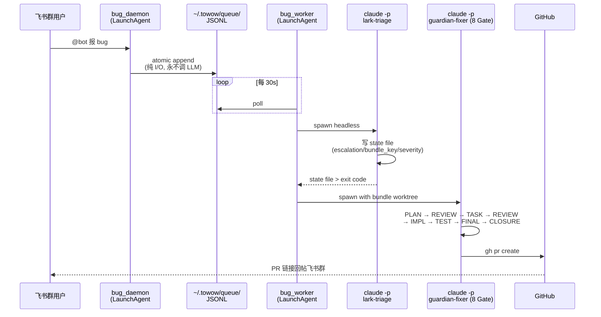

# lark-bug-pipeline

[](https://github.com/NatureBlueee/lark-bug-pipeline/releases)
[](./LICENSE)
[](https://claude.com/claude-code)
[](https://github.com/NatureBlueee/lark-bug-pipeline/pulls)

> **飞书群 @bot 发一句 bug → 15 分钟后 GitHub 上自动开好 PR。**
> Feishu (Lark) group chat bug report → auto PR on GitHub in ~15 minutes. **$0 API cost.**

真实证据：首个真用户反馈的完整闭环 PR 👉 [NatureBlueee/Towow#90](https://github.com/NatureBlueee/Towow/pull/90) （triage 2min · fixer 6.7min · 端到端 ~15min）

<p align="center">
  
  <br>
  <sub>左：用户在飞书群 @bot 报 bug ｜ 中：本地 daemon 日志 ｜ 右：自动生成的 PR</sub>
</p>

## What you get

- 📥 **用户反馈零门槛**：飞书群 @bot 一句话，不用填表、不用提 issue、不用翻文档
- 🖼️ **多模态输入**（v0.2）：支持纯文字 / 富文本 / 纯图片 / 文件附件——用户直接甩截图，Claude Code 原生读图定位 UI 错误
- 🧠 **8 Gate 闭环修复**：triage → PLAN → REVIEW → TASK → REVIEW → IMPL → TEST → FINAL-REVIEW → CLOSURE，每步 artifact 可回溯
- 🚀 **端到端 ~15 分钟**：bug 话音落地到 PR 链接回到飞书群
- 💸 **$0 API 成本**：走你本地的 Claude Code Max/Pro 订阅，不走 Anthropic API billing

## 成本对比

| 方案 | 单个 PR 成本 | 运行位置 | 开发能力 |
|---|---|---|---|
| Sweep AI | ~$0.20 / PR | 云端沙箱 | 受沙箱能力限制 |
| Codegen | 订阅制（$$$） | 云端容器 | 受容器能力限制 |
| **lark-bug-pipeline** | **$0**（走订阅） | **本地 Claude Code** | **= 完整 Claude Code 能力** |

> **为什么本地 Claude Code 更强**：不需要容器化、能直接访问你的开发环境 / IDE / toolchain / MCP servers / 已登录的 gh 和数据库连接。修复范围不被沙箱边界切掉。

---

## 5 分钟装完

前置：macOS + `python3` + [Claude Code](https://claude.com/claude-code) CLI 已登录 + 一个 GitHub 仓库 + `guardian-fixer` skill（[详情](#依赖--硬性前提)）。

```bash
cd <your-repo>   # 必须在 git 仓库里
curl -fsSL https://raw.githubusercontent.com/NatureBlueee/lark-bug-pipeline/main/bootstrap.sh | bash
```

然后按脚本打印的 3 步做完：复制 env 模板 → 填 4 个变量 → `bash .claude/skills/lark-bug-pipeline/install.sh`。

装完之后在飞书群 @bot 发一条 bug，~15 分钟后去 GitHub 看 PR。

<details>
<summary>🤖 或者：让你的 AI 自己装</summary>

在任何 Claude Code session 里说一句：

> 帮我装 lark-bug-pipeline，仓库在 https://github.com/NatureBlueee/lark-bug-pipeline

Claude 会自己读这个 README、跑 bootstrap、然后按 skill 里的「AI 指导模式」一步步问你飞书配置、帮你开 scope、告诉你 bot open_id 去哪抄。全程你只负责回答问题和粘贴 App ID。
</details>

<details>
<summary>📦 或者：手动 git clone</summary>

```bash
git clone https://github.com/NatureBlueee/lark-bug-pipeline .claude/skills/lark-bug-pipeline
rm -rf .claude/skills/lark-bug-pipeline/.git
mkdir -p ~/.towow
cp .claude/skills/lark-bug-pipeline/templates/env.lark.example ~/.towow/.env.lark
$EDITOR ~/.towow/.env.lark     # 填 LARK_APP_ID / APP_SECRET / BOT_OPEN_ID / NATURE_OPEN_ID
bash .claude/skills/lark-bug-pipeline/install.sh
```
</details>

---

## 为什么

早期产品有一堆 bug，但:
- 用户懒得写 issue
- 开发者看不到 Sentry 以外的反馈
- 就算看到了也挤不进 sprint

传统方案是 Sentry + Linear + Jira 三件套，链路任何一环断了 bug 就烂在后台。这个 skill 把整条链路压缩到一次 @bot + 自动 15 分钟 PR：

| 环节 | 传统做法 | 本 skill |
|---|---|---|
| 用户反馈 | 提 GitHub Issue / 写邮件 / 填表 | 飞书群 @bot 一句话 |
| 分诊 | PM 人工判断优先级 | `lark-triage` sub-skill 自动分 auto / needs_clarification / out_of_scope / needs_admin |
| 修复 | 排期进 sprint | `guardian-fixer` 8 Gate（PLAN → REVIEW → TASK → REVIEW → IMPL → TEST → FINAL-REVIEW → CLOSURE） |
| PR | 人工写描述 + 补测试 + 找 reviewer | `gh pr create` 自动带双语标题 + reporter 署名 + 8 Gate artifact |
| 成本 | $$$ 人天 | **$0 API 成本**（走 Claude Code 订阅而非 API billing） |
| 对用户 | "我们会处理" | 飞书群直接回复 + PR 链接 + 报告人 attribution |

---

## 真实运行证据

首个真用户 bug 的完整闭环：[NatureBlueee/Towow#90](https://github.com/NatureBlueee/Towow/pull/90)

时间分解：
- triage: 2 min（Opus 4.6，判定 `escalation=auto` + 写 issue 草稿 + 决定 bundle_key）
- fixer: 6.7 min（8 Gate 全过，PLAN → REVIEW → TASK → REVIEW → IMPL → TEST → FINAL-REVIEW → CLOSURE）
- git/gh bookkeeping: ~1 min
- **端到端: 约 15 分钟**

---

## 架构一眼图



细节见 `docs/architecture.md`。

---

## 🔒 安全与信任边界

- **只开 PR，从不推 main**：所有产出走标准 PR review flow，你保留最终合并权
- **从不 force-push**：fixer worktree 独立分支，不动历史
- **本地运行，无云端代码上传**：Claude Code 在你的 Mac 上跑，代码不离开你的开发机（Anthropic 服务只看到 prompt，不看到仓库快照）
- **最小权限飞书 scope**：默认只需要 `im:message` / `im:message.group_at_msg` / `im:message:send_as_bot`，不读历史、不读联系人
- **环境变量在 `~/.towow/.env.lark`**：不进仓库、不进 git history

---

## 依赖 / 硬性前提

- **macOS**（用 launchd；Linux 改 systemd unit 也行，`docs/architecture.md` 有扩展说明）
- **Claude Code CLI 已登录**（`which claude` 有输出；不是 Anthropic API key，是你的 Claude Pro/Max 订阅 session）
- **你自己的 Claude Code harness 里有 `guardian-fixer` skill**——这是 8 Gate 闭环的核心，本 skill **不打包它**，因为它和你的仓库工程规范深度耦合。你可以：
  - 用 Towow 仓库里的 `.claude/skills/guardian-fixer/`（参考实现，MIT）
  - 或自己写一个符合你团队 gate 的版本
- **飞书自建应用**：需要 `im:message` + `im:message.group_at_msg` + `im:message:send_as_bot` 三个 scope。配置步骤 `docs/feishu-setup.md`。

---

## 目录结构

```
lark-bug-pipeline/
├── SKILL.md                  # AI 操作手册（Claude Code 读这个）+ AI 指导模式 section
├── README.md                 # 你正在读的这个（对人 pitch）
├── install.sh                # 一键装（sed render plist + launchctl bootstrap）
├── runtime/
│   ├── bug_daemon.py         # 飞书 WS 长连接 → 队列写入（纯 I/O，~900 行）
│   ├── bug_worker.py         # 队列 poll → claude -p spawn → PR
│   └── lark-triage.md        # 子 skill：把 bug 原话翻译成 guardian-fixer 合同
├── templates/
│   ├── env.lark.example      # ~/.towow/.env.lark 模板
│   ├── net.towow.lark-daemon.plist.tmpl
│   └── net.towow.lark-worker.plist.tmpl
└── docs/
    ├── architecture.md       # 数据流 / 进程边界 / state-file 权威 / 扩展点
    └── feishu-setup.md       # 飞书侧从零配置（IM 默认 + bitable 可选升级附录）
```

---

## 设计亮点

**Crash-only software ordering**：triage 必须先写 state file（几十字的结构化合同）再写 issue draft（几 KB 叙述）。前者落盘后即使进程 SIGKILL，pipeline 不会回到 `needs_admin`。

**State file > exit code**：`claude -p` headless 在 budget 边界/网络抖动时会吐 exit 1，但此时 state file 可能已经写完。worker 先查 state file，只有缺失才回退到 exit code。

**Bundle 聚合 + worktree 隔离**：triage 输出的 `bundle_key`（如 `website/components`）决定 fixer 的 worktree 名字——多个关联 bug 可以共享一个 bundle，fixer 跑一次改多条；不同 bundle 各自独立 worktree，互不污染。

**AI 指导安装**：SKILL.md 里有一整块用 [soul-writing](https://github.com/anthropics/prompt-library) 方法论写的"AI 指导模式"——人格锚定 + 双向校准清单 + 反模式命名——保证任何用户把 skill 扔给 Claude Code，Claude 就会变成"上周刚帮另一个人装过同样东西的工程师朋友"一步步带他装完，不翻文档、不倒日志、不吐术语。

---

## 许可证

MIT。把它改成你想要的样子、塞进你自己的产品、商用、改 plist 变 systemd——都可以。只要求保留 LICENSE 文件里的署名。

---

## 搭配 Towow 全家桶使用（可选）

这个 skill 是完全独立的——你可以什么都不装，只用这一个 skill，照样能闭环。

但它是我（Nature）在做 [Towow 通爻](https://towow.net)（Agent 协作协议网络）的时候为自己的早期用户反馈循环搭的，搭完发现可以通用化所以抽出来独立发行。如果你想要一整套"AI 原生开发"的 Claude Code harness，Towow 还有这些配套的 skill / agent：

| skill | 做什么 |
|---|---|
| **guardian-fixer** | 本 pipeline 的 8 Gate 闭环本体——PLAN → REVIEW → TASK → REVIEW → IMPL → TEST → FINAL-REVIEW → CLOSURE，任何可 reproducible 的 issue 都能自动修 |
| **lead** | 开发流程状态机（fail-closed）——从想法到生产代码的全链路编排 |
| **soul-writing** | 行为宪法与 prompt 构建方法论（本 skill 的「AI 指导模式」章节就是用它写的） |
| **towow-ops** | 跨后端/前端/MCP/配置/文档的一致性守护 |
| **towow-crystal-learn** | 结晶学习——从失败里提取不变量，自动注入 CLAUDE.md |

全家桶形成了一个从"用户反馈"到"架构治理"到"生产修复"再到"自省学习"的闭环。lark-bug-pipeline 是这个闭环的**入口 tier**——把用户声音翻译成 agent 可执行的合同。

如果你对整个 agent-native 开发范式感兴趣，访问 [towow.net](https://towow.net)。

---

## 我做了什么 / Credits

这个 pipeline 由 [Nature](https://github.com/NatureBlueee) 为 Towow 通爻的早期用户反馈循环设计实现，triage + guardian-fixer 的 8 Gate 方法论源自 Towow 的 ADR-030 governance reload + ADR-040 lark-bug-pipeline 决策。

Issue / PR 欢迎。
